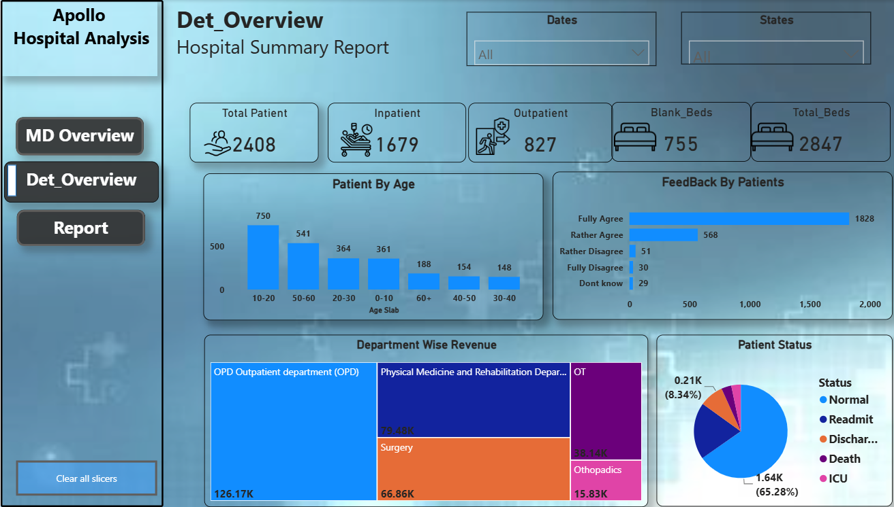
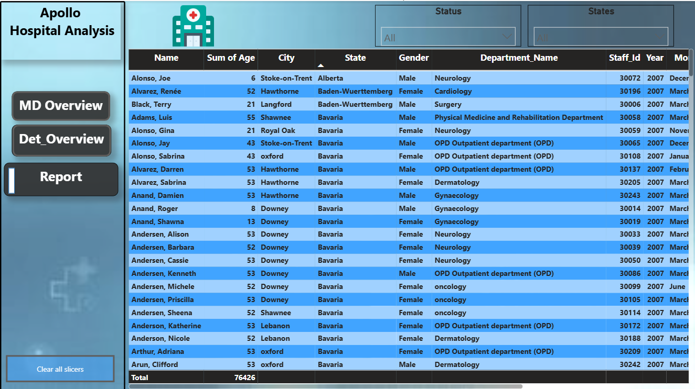

<h1 align="center">HealthCare Dashboard</h1>

<p align="center">
  
  
  
  
</p>

---

## 📌 Project Overview

This dashboard transforms raw healthcare data into interactive visualizations, enabling users to monitor hospital operations, analyze patient trends, and support data-driven decision-making.

---

## 🎯 Objectives

- Analyze patient demographics
- Monitor admissions and discharges
- Evaluate treatment outcomes
- Track hospital performance
- Identify healthcare trends using interactive visuals

---

## Dataset Information

The project uses a simulated HealthCare Industry Dataset containing Staff, Beds, Deparments, Overall Management.

### Dataset Characteristics

* One Year of Hospital Data
* 2506 Patients 
* Staff Details
* Bed Details
* Overall Management
* Multiple  Categories of Deparments
* Patients Status
* Revenue
* Patients Satisfactions / Feedback

---
 
## Data Model

### Fact Table

* Fact_Detail_Data

### Dimension Tables

* Dim_Staff_Details
* Dim_Deparments
* Dim_Bed_Details


The data model follows a star schema approach for efficient reporting and analytical performance.

---
## Tools and Technologies

* Power BI Desktop
* Power Query
* DAX
* Data Modeling
* Microsoft Excel
* Data Visualization
* Business Intelligence Reporting

---

## 📊 Dashboard Features

- 📈 Interactive KPI Cards
- 👨‍⚕️ Patient Demographics Analysis
- 🏥 Hospital Performance Dashboard
- 📅 Admission & Discharge Trends
- 📍 Dynamic Filters & Slicers

---

## 📂 Repository Structure

```
Healthcare-Analytics/
│
├── Assets/
    |_MD_Overview.png
    |_Det_overview,png
    |_Table.png
├── DOcumentation/
    |_
├── Power_Bi/
│   └── E:\ARC Classes\Power BI\Project\Health Care Data\Health_Care_Analysis\Power_BI Report\HealthCare.pbix
└── README.md
```

---

## 📈 Key Insights

- Total Patients
- Total Admissions
- Average Length of Stay
- Treatment Success Rate
- Department-wise Performance
- Gender & Age Distribution
- Monthly Admission Trends

---

## 🚀 Skills Demonstrated

- Data Cleaning
- Data Transformation
- Data Modeling
- DAX Calculations
- KPI Development
- Dashboard Design
- Business Intelligence
- Data Visualization

---

## 📷 Dashboard Screenshots

### Home page


### Det_Overview



### Report



---

## 📥 How to Use

1. Clone this repository.

```bash
git clone https://github.com/sahil983461/Healthcare-Analytics.git
```

2. Open the Power BI report located inside the 02_powerbi_report folder.

3. Refresh the dataset (if required).

4. Explore the interactive dashboard.

---

## 📌 Future Improvements

- Real-time data integration
- Predictive healthcare analytics
- Advanced DAX measures
- Patient risk prediction
- Performance optimization

---

## 👨‍💻 Author

## Sahil Misar

- GitHub:https://github.com/sahil983461
- Email: [sahilmisar7@gmail.com](mailto:sahilmisar7@gmail.com)

---

## License

This project is intended for educational, portfolio, and demonstration purposes.